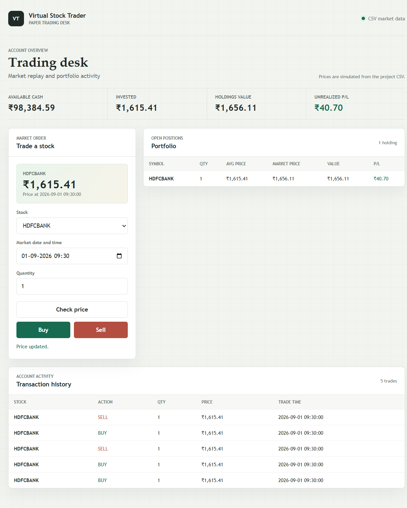

# Virtual Stock Trading Platform

A virtual stock trading simulator built with Flask and SQLite, using generated CSV-based historical market data. No real money or login is involved; the app uses one predefined account.

## Features

- Browse 10 stocks with simulated historical prices
- Look up a stock price at a selected date and time (30-minute intervals)
- Buy and sell shares using virtual cash
- Track holdings, average purchase price, market value, and unrealized profit/loss
- Review transaction history and realized profit/loss from sales

## Tech Stack

- Backend: Python and Flask
- Database: SQLite in-memory database
- Frontend: HTML, CSS, and JavaScript
- Market data: CSV, generated by `generate_data.py` (10 stocks, 12 weekdays, 13 intervals per day; 1,560 rows)

## Requirements

- Python 3.10 or later
- pip

## Setup (Windows PowerShell)

Clone the repository and enter the project folder:

```powershell
git clone https://github.com/dattatraychoudaj-wq/virtual-stock-trader.git
cd virtual-stock-trader
```

Then create and activate a virtual environment and start the app:

```powershell
python -m venv .venv
.\.venv\Scripts\Activate.ps1
python -m pip install -r requirements.txt
python generate_data.py
python app.py
```

If PowerShell blocks virtual-environment activation, run the app with the environment's Python directly:

```powershell
.\.venv\Scripts\python.exe -m pip install -r requirements.txt
.\.venv\Scripts\python.exe generate_data.py
.\.venv\Scripts\python.exe app.py
```

Open <http://127.0.0.1:5000/>. The stock list, price lookup, portfolio, and transaction history APIs are also available at `/stocks`, `/price`, `/portfolio`, and `/transactions`. Buy and sell requests use the `/buy` and `/sell` POST endpoints.

## Data and Account Reset

`generate_data.py` creates `data/stock_prices.csv`. The account, cash balance, holdings, and transaction history live in an in-memory database, so they reset to the starting balance of ₹1,00,000 whenever the app process restarts. The generated market data uses random price movements; rerunning the generator replaces the CSV with a new sample series.

## Screenshots

### Trading Dashboard



## Demo Video

**[Watch or download the 30-second demo](virtual-stock-trader-30-second-demo.mp4)**

The screen recording shows the trading dashboard. Prices are sample historical data and trades use virtual money only. The longer walkthrough plan is in [DEMO_SCRIPT.md](DEMO_SCRIPT.md).
